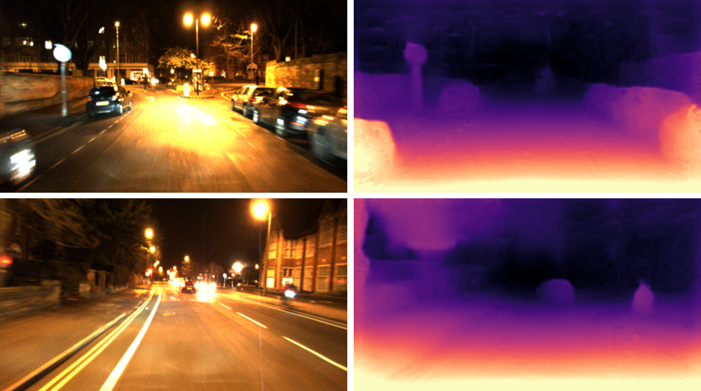
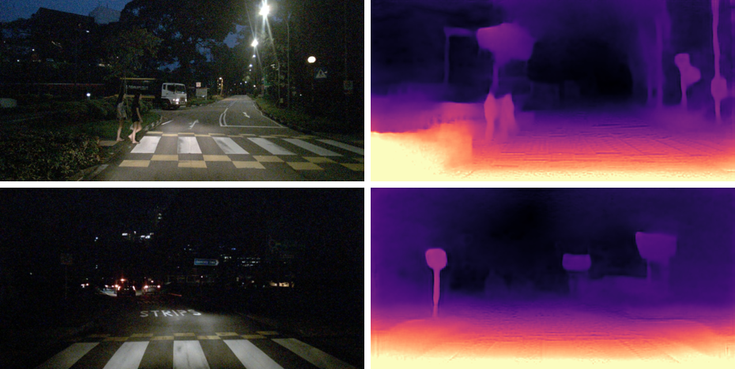

# RNW

This repository contains test codes for *Regularizing Nighttime Weirdness: Efficient Self-supervised Monocular Depth Estimation in the Dark*.

## Checkpoint

Checkpoints trained on RobotCar-Night and nuScenes-Night will be publicly available soon.

## Usage

There are four samples in `samples/`, their depth maps can be generated using the follow command:

```bash
python test.py sample checkpoint outdir
```

For example, we can obtain the depth of sample *rc_sample_1.png* by running:

```bash
python test.py samples/rc_sample_1.png checkpoint_rc output/
```

## Result



